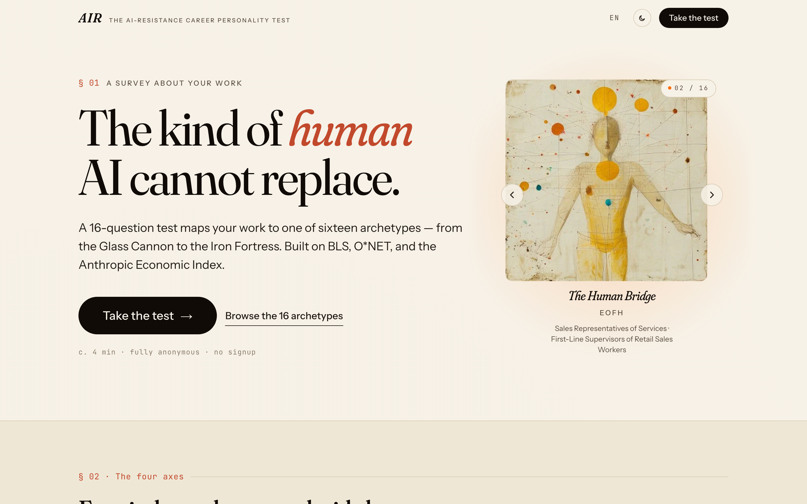
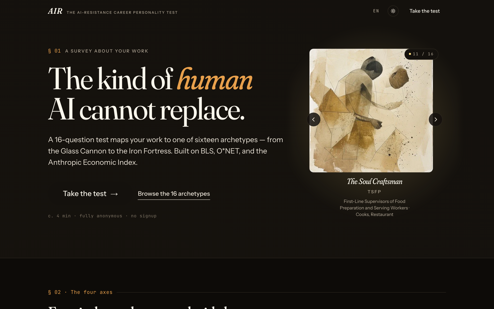
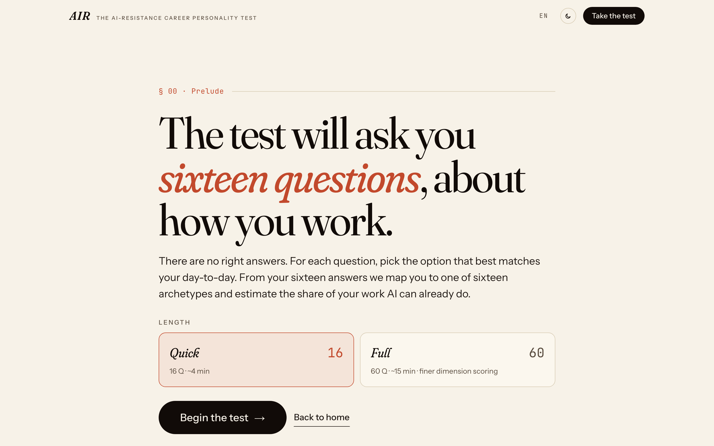
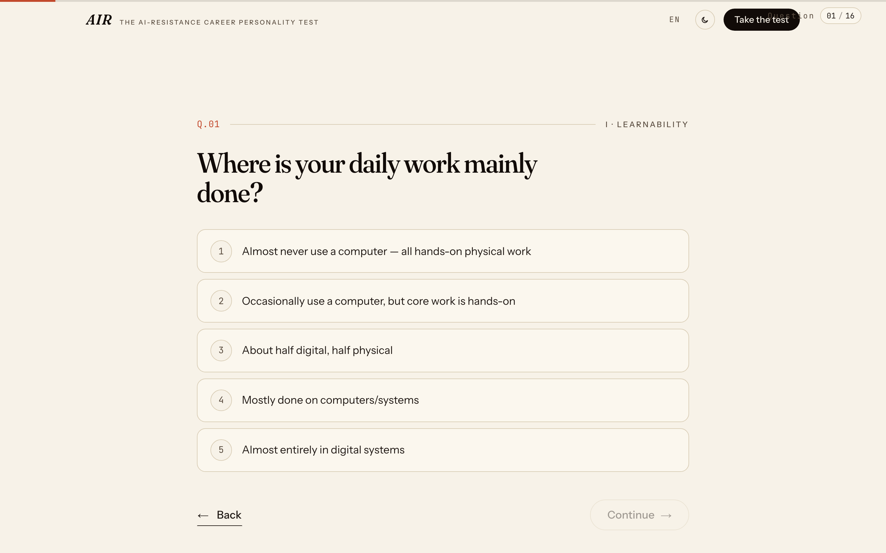
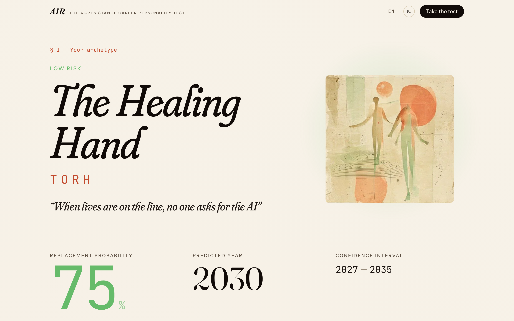
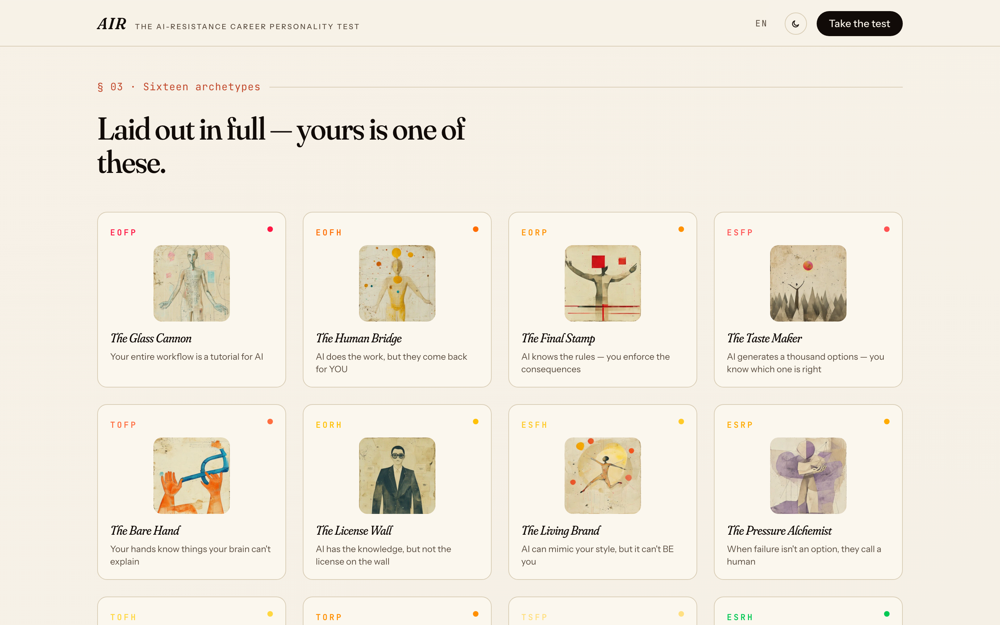
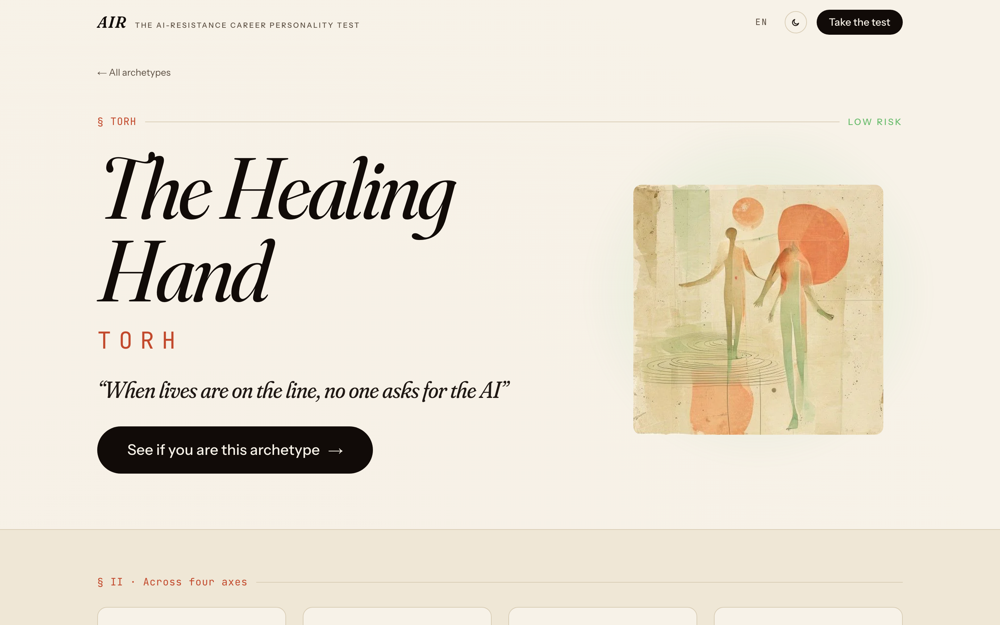
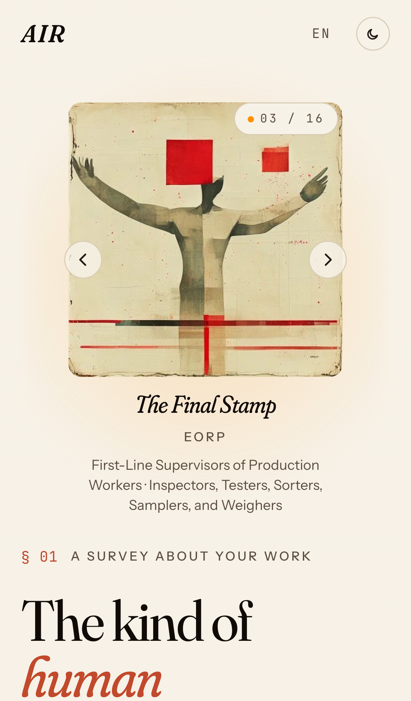
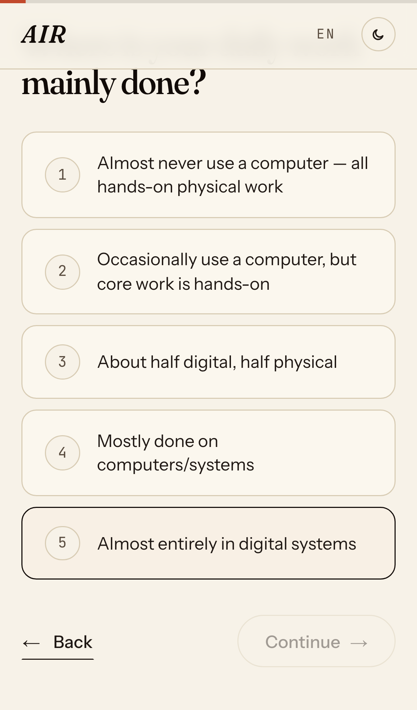

<div align="center">

# *AIR*

### The AI-Resistance Career Personality Test

A 16-question editorial test that maps your profession to one of 16 archetypes — from *the Glass Cannon* to *the Iron Fortress* — and estimates how much of your work AI can already do.

**[→ Take the test at air.democra.ai](https://air.democra.ai)**

[](https://air.democra.ai)
[](https://workers.cloudflare.com/)
[](https://nextjs.org/)
[](LICENSE)


</div>

<br />



---

## What this is

A serious-looking personality test that asks one question: **which kind of working human can AI not replace?**

Most personality tests measure who you are. AIR measures what your *job* is made of. The 16 questions probe four independent axes drawn from automation-economics literature:

| Axis | Letters | What it asks |
|---|---|---|
| **Learnability** | **E** ↔ **T** | Can your knowledge be written down and learned by a machine, or is it tacit and bodily? |
| **Evaluation** | **O** ↔ **S** | Can the quality of your work be measured objectively, or does it require subjective taste? |
| **Risk Tolerance** | **F** ↔ **R** | Can a mistake be undone, or is the consequence permanent? |
| **Human Presence** | **P** ↔ **H** | Does the work happen between people and a product, or between two people? |

Four binary axes → 2⁴ = **16 archetypes**, scored on a Weighted Power Mean (r=−2) — the "Swiss Cheese Barrier Model" where a single strong axis is enough to break AI's replacement chain.

The result page tells you your archetype, your replacement probability, the year by which the math says your work flips, and a one-sentence superpower / kryptonite. Then it lets you share it.

<br />

## Screenshots

<table>
<tr>
<td width="50%"></td>
<td width="50%"></td>
</tr>
<tr>
<td><sub><b>Home · light.</b> Asymmetric editorial hero with an archetype carousel — left/right keys or swipe to flip through all 16.</sub></td>
<td><sub><b>Home · dark.</b> The warm-black variant. Same composition, amber accent instead of terracotta.</sub></td>
</tr>
</table>

<table>
<tr>
<td width="50%"></td>
<td width="50%"></td>
</tr>
<tr>
<td><sub><b>Quiz intro.</b> Choose Quick (16 Q · ~4 min) or Full (60 Q · ~15 min, finer per-axis scoring). Either path lands on the same 16 archetypes.</sub></td>
<td><sub><b>One question per screen.</b> Tap to select; tap the same option again to advance. Thin terracotta ribbon at the top tracks progress.</sub></td>
</tr>
</table>

<table>
<tr>
<td width="50%"></td>
<td width="50%"></td>
</tr>
<tr>
<td><sub><b>Result.</b> Big italic Fraunces archetype name, mono 4-letter code, watercolor illustration, replacement % as an editorial display number.</sub></td>
<td><sub><b>16-archetype grid.</b> Salon-style. Clicking the hero illustration scrolls here and pulses the matching card.</sub></td>
</tr>
</table>

<table>
<tr>
<td width="33%"></td>
<td width="33%"></td>
<td width="33%"></td>
</tr>
<tr>
<td><sub><b>Profile page.</b> One static URL per archetype (`/profile/TORH`, etc.). Hero glyph + tagline + superpower/kryptonite + typical jobs. Good for SEO.</sub></td>
<td><sub><b>Mobile.</b> Hero reflows to a single column with the illustration on top.</sub></td>
<td><sub><b>Mobile quiz.</b> Larger tap targets (44 pt min on touch), full-bleed option cards.</sub></td>
</tr>
</table>

<br />

## Features

- **16 archetypes, painterly illustrations.** Each archetype has a custom abstract watercolor (Flux + a locked editorial style prompt) rendering its metaphor — translucent glass torso, scissor-hands cleaving chaos, figure cocooned by concentric rings — not a portrait. The set shares a single warm-cream paper + ink-line voice.
- **Two test lengths.** 16 questions for a 4-minute read; 60 questions for finer per-axis scoring. Same backend, same 16 outcomes.
- **Editorial typography.** Fraunces (variable serif, SOFT/WONK/opsz axes) for display, Instrument Sans for body, JetBrains Mono for codes and percentages.
- **Light + dark.** Both warm. Light is ivory paper, deep coffee ink, terracotta accent. Dark is warm-black with amber. Light is the default — dark is opt-in.
- **Five languages, native quality.** EN · 中文 · 日本語 · 한국어 · Deutsch. Every UI string is translated by hand in `lib/ui_text.ts`. The language switcher updates both client state and the URL `?lang=` so server-rendered share/profile pages re-render too.
- **Result sharing.** Twitter, Weibo, copy link. Share URLs encode the full result in a URL-safe base64 payload — no database lookup needed to render someone else's result.
- **Per-archetype SEO pages.** `/profile/EOFP`, `/profile/TSRH`, etc. — 16 static-rendered landing pages so each type can rank on its own.
- **Mobile-first.** ~80% of test traffic is iPhone. Every grid reflows or rearranges below 760 px with grid-area swaps, not just stacking.

<br />

## Tech stack

| Concern | Choice |
|---|---|
| Framework | [Next.js 16](https://nextjs.org/) (App Router, React 19) |
| Hosting | [Cloudflare Workers](https://workers.cloudflare.com/) via [`@opennextjs/cloudflare`](https://opennext.js.org/cloudflare) |
| Database | [Cloudflare D1](https://developers.cloudflare.com/d1/) — `quiz_sessions`, `answer_distributions`, `answer_aggregate` |
| KV | [Cloudflare KV](https://developers.cloudflare.com/kv/) — rate-limit + rollup counters |
| Telemetry | First-party `/api/track/*` endpoints (Analytics Engine optional) |
| Anti-abuse | [Cloudflare Turnstile](https://developers.cloudflare.com/turnstile/) (invisible, soft-fails open) |
| Styling | Tailwind CSS v4 + custom design system in `app/globals.css` |
| Type system | TypeScript (strict) |
| Fonts | Fraunces · Instrument Sans · JetBrains Mono (Google Fonts) |
| Illustrations | 16 hand-prompted Flux watercolors, baked as WebP (~50 KB each) |
| E2E test runner | [Playwright](https://playwright.dev/) (also used for screenshots) |

<br />

## Repository layout

```
app/
  layout.tsx                  Fonts, theme bootstrap, metadata
  page.tsx                    Landing — hero / dimensions / archetypes / methodology
  share/[payload]/            Result page (SSR from base64 payload + ?lang= override)
  profile/[code]/             16 SEO pages, one per archetype
  api/track/                  /event /session /answer-dist  → D1
  api/poster/[payload]/       OG / share-card image generator
  api/share/telegram/         Telegram poster delivery
  opengraph-image.tsx         Default OG card
  sitemap.ts, robots.ts

components/
  shell/                      Nav, Footer, AnalyticsProvider, useLang, useTheme
  quiz/                       QuizFlow, QuizIntro (mode picker), QuestionCard,
                              ProgressRibbon, CompletingScreen
  result/                     ArchetypeSvg ( of /characters-art/*.webp),
                              HeroCarousel
  characters/                 16 legacy SVG glyphs (kept; not currently rendered)

lib/
  air_quiz_data.ts            16-question schema, 4 dimensions, 16 profile types
  air_quiz_data_60.ts         60-question Full variant
  air_quiz_calculator.ts      Scoring → 4-letter code → profile → probability
  air_career_data.ts          Per-archetype career examples (BLS / O*NET)
  air_advice_data.ts          Per-axis superpower/kryptonite advice
  share_payload.ts            URL-safe base64 share payload encode/decode
  ui_text.ts                  All UI strings × 5 languages
  translations.ts             Quiz-content translations (lib-managed)
  cloudflare.ts               D1 / KV bindings + Turnstile verify + rate-limit
  analytics.ts                track* helpers → /api/track/*

public/
  characters-art/             16 WebP illustrations
  character-posters/          Earlier poster series (kept for reference)
  share-card.png              Default OG card

migrations/
  0001_init.sql               D1 schema

docs/
  screenshots/                README assets (this folder)
  air_quiz_16_*.md            Quiz content reference, 5 languages
  air_quiz_60_*.md            Long-form quiz, 5 languages
  plans/                      Design plans
```

<br />

## Architecture

```
                                  ┌──────────────────────────────────┐
                                  │  Cloudflare edge (Workers)       │
                                  │                                  │
   browser  ─────HTTPS───────▶    │   Next.js (OpenNext build)       │
   (any              proxied        ├─ /                  landing    │
    geo)                            ├─ /share/[payload]   result     │
                                    ├─ /profile/[code]    SEO        │
                                    └─ /api/track/*       writes     │
                                              │                      │
                                              ▼                      │
                                  ┌────────────┐  ┌────────────┐    │
                                  │   D1       │  │   KV       │    │
                                  │ air        │  │ AIR_KV     │    │
                                  ├────────────┤  ├────────────┤    │
                                  │ quiz_      │  │ rate-      │    │
                                  │ sessions   │  │ limit      │    │
                                  │ answer_    │  │ rollup     │    │
                                  │ distrib.   │  │ counters   │    │
                                  │ answer_    │  └────────────┘    │
                                  │ aggregate  │                    │
                                  └────────────┘                    │
                                  └──────────────────────────────────┘
```

Everything runs on the edge — no origin server. The result page is server-rendered from a base64 payload encoded into the URL, so sharing a link doesn't require a database lookup.

<br />

## Local development

```bash
# 1. Install
npm install

# 2. Dev server (Next.js, no Worker runtime)
npm run dev                       # http://localhost:3000

# 3. Preview in the actual Worker runtime
npm run cf:preview                # opennextjs build + wrangler pages dev

# 4. Typecheck + tests
npm run typecheck
npm run test                      # Playwright
```

### Updating screenshots

```bash
# default base is https://air.democra.ai;
# override to your local or workers.dev URL if the zone is WAF-blocking you
AIR_BASE=https://air-quiz.tao-shen.workers.dev node scripts/screenshots.mjs
```

### D1 schema changes

```bash
# Apply against the local SQLite simulator
npm run cf:d1:apply:local

# Apply against the remote D1 (requires wrangler login + write scope)
npm run cf:d1:apply:remote
```

<br />

## Deployment

```bash
# One-shot: build with OpenNext + deploy the Worker
npx wrangler deploy --config=./wrangler.toml
```

After a fresh clone you also need to create the Cloudflare resources once:

```bash
wrangler d1 create air
wrangler kv namespace create AIR_KV
# paste the IDs into wrangler.toml
wrangler d1 migrations apply AIR_DB --remote
```

The custom domain (`air.democra.ai`) is a Worker Custom Domain binding — Cloudflare manages DNS and SSL automatically once it's added in the dashboard. See [DEPLOY.md](DEPLOY.md) for the full step-by-step.

<br />

## Sibling project

The same data and the same authors power the longer-form macro report on AI's impact on employment — industry breakdowns, layoff tracker, the AI-replacement timeline — at **[risk.democra.ai](https://risk.democra.ai)**. This repo is the focused test; that one is the report.

<br />

## Acknowledgements

Underlying data drawn from:

- BLS Occupational Employment & Wage Statistics 2023 (798 occupations)
- O\*NET task structure
- Eloundou et al. 2023 — *GPTs are GPTs: Labor Market Impact Potential of LLMs* (19,265 tasks)
- OpenAI GDPval — blind-judged AI-vs-expert win rates (44 occupations measured; sector/global averages for the rest)
- World Economic Forum *Future of Jobs Report 2025*

Type set in **Fraunces** by Phaedra Charles & Flavia Zimbardi, **Instrument Sans** by Instrument, and **JetBrains Mono** by JetBrains.

<br />

## License

[MIT](LICENSE)

<br />

<div align="center">
<sub>Made by <a href="https://democra.ai">Democra AI</a>. Built on Cloudflare. Set in Fraunces.</sub>
</div>
